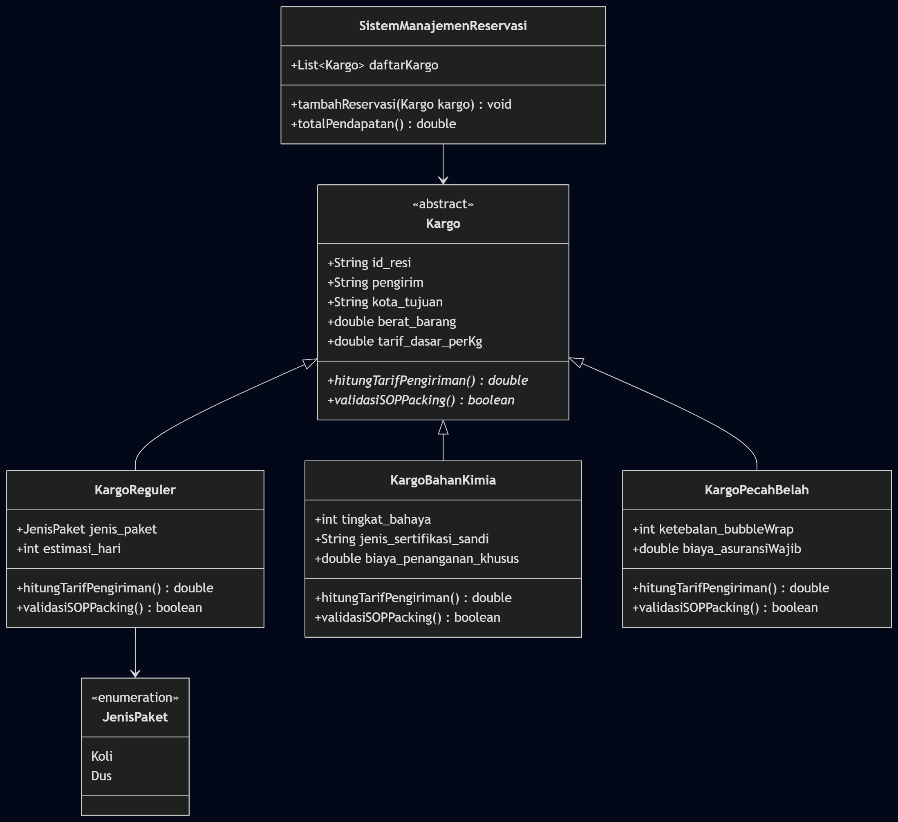

# 📦 LogiCargo System

> **Sistem Manajemen Reservasi & Kalkulasi Tarif Cargo Ekspedisi Logistik berbasis Pemrograman Berorientasi Objek (OOP) & PHP**

Proyek ini dibangun untuk mendemonstrasikan implementasi komprehensif dari konsep **Pemrograman Berorientasi Objek (PBO/OOP)** dengan studi kasus pengelolaan kargo logistik yang dinamis dan terhubung dengan basis data relasional MySQL.

[](https://www.php.net/)
[](https://www.mysql.com/)
[](#)
[](#)

---

## 📖 Deskripsi Proyek

**LogiCargo System** adalah aplikasi manajemen logistik kargo yang dirancang khusus untuk memodelkan proses bisnis pengiriman barang dengan mengimplementasikan empat pilar utama OOP secara mendalam: **Abstraction, Encapsulation, Inheritance,** dan **Polymorphism**. 

Aplikasi ini mendukung tiga kategori kargo dengan karakteristik perhitungan tarif dan SOP packing yang berbeda:
1. **Kargo Reguler**: Pengiriman paket standar (koli/dus) dengan estimasi waktu tertentu.
2. **Kargo Bahan Kimia**: Pengiriman bahan kimia sensitif yang memerlukan penanganan khusus berdasarkan tingkat bahaya serta sertifikasi sandi MSDS/UN.
3. **Kargo Pecah Belah (Fragile)**: Pengiriman barang rentan pecah dengan proteksi bubble wrap tebal dan asuransi wajib.

---

## 🛠️ Panduan Instalasi & Cara Menjalankan

Ikuti langkah-langkah berikut untuk menjalankan LogiCargo System di lingkungan lokal Anda:

### 1. Prasyarat (Prerequisites)
Pastikan Anda sudah menginstal:
* **Web Server & Database**: XAMPP / Laragon (PHP 8.1 ke atas & MySQL)
* **Web Browser**: Chrome, Firefox, Edge, dll.
* **Git** (Opsional, untuk kloning repositori)

### 2. Langkah-Langkah Instalasi
1. **Kloning Repositori**
   Pindahkan repositori ini ke folder root web server Anda (`htdocs` jika menggunakan XAMPP, atau `www` jika menggunakan Laragon):
   ```bash
   git clone https://github.com/rizqibogorcihuyyy01/PHP_PBO_Project_kelompok_kargo.git
   ```
2. **Import Database**
   * Jalankan Apache dan MySQL pada control panel XAMPP/Laragon.
   * Buka browser dan akses **phpMyAdmin** (`http://localhost/phpmyadmin`).
   * Buat database baru bernama `db_kargo_ekspedisi`.
   * Pilih database tersebut, masuk ke tab **Import**, lalu pilih file `db_kargo_ekspedisi.sql` yang berada di direktori utama proyek ini.
   * Klik **Import** / **Go** dan tunggu hingga seluruh skema tabel berhasil diimpor.
3. **Konfigurasi Koneksi**
   * File konfigurasi database berada di [database.php](file:///c:/Users/ADVAN/Documents/GitHub/PHP_PBO_Project_kelompok_kargo/kargo-lengkap-test/config/database.php).
   * Pastikan konfigurasi host, nama database, username, dan password telah sesuai dengan pengaturan server Anda:
     ```php
     private $host = "localhost";
     private $db_name = "db_kargo_ekspedisi";
     private $username = "root"; // Default XAMPP
     private $password = "";     // Default XAMPP
     ```

### 3. Menjalankan Aplikasi
* Buka browser Anda.
* Akses URL dasbor aplikasi pengujian di:
  ```
  http://localhost/PHP_PBO_Project_kelompok_kargo/kargo-lengkap-test/index.php
  ```
* Halaman dasbor interaktif akan menampilkan data transaksi kargo dari database lengkap dengan visualisasi statistika kargo dan total pendapatan yang dikalkulasi secara polimorfik secara real-time.

---

## 📁 Struktur Folder Proyek

```text
PHP_PBO_Project_kelompok_kargo/
├── Class/                          # Implementasi Kelas Model Dasar (Versi Awal)
│   ├── kargo.php                   # Kelas abstrak kargo
│   ├── kargoreguler.php
│   ├── kargobahankimia.php
│   └── kargopecahbelah.php
├── kargo-lengkap-test/             # Modul Aplikasi Lengkap Terintegrasi
│   ├── classes/                    # Struktur Kelas Model OOP & Controller
│   │   ├── Kargo.php               # Master Abstract Class (Induk)
│   │   ├── KargoReguler.php        # Subclass Kargo Reguler
│   │   ├── KargoBahanKimia.php     # Subclass Kargo Bahan Kimia
│   │   ├── KargoPecahBelah.php     # Subclass Kargo Pecah Belah
│   │   └── ManajemenKargo.php      # Controller & Polymorphic Driver Specialist
│   ├── config/
│   │   └── database.php            # Kelas Koneksi Database dengan OOP Constructor
│   └── index.php                   # Tampilan User Interface (Dasbor Statistik)
├── db_kargo_ekspedisi.sql          # Ekspor Skema Database MySQL Relasional
├── UML.png                         # File Class Diagram UML Resmi Proyek
└── README.md                       # Manifes Dokumentasi Proyek (File ini)
```

---

## 📊 Class Diagram UML

Berikut adalah pemetaan visual dari arsitektur kelas pada sistem **LogiCargo** yang memodelkan relasi generalisasi (pewarisan), tipe data properti, tingkat akses data (access modifier), dan metode yang disediakan:



### Keterangan Hubungan Antar Kelas:
* **Generalisasi (Inheritance / Pewarisan)**: Ditunjukkan dengan garis panah berujung segitiga kosong dari `KargoReguler`, `KargoBahanKimia`, dan `KargoPecahBelah` ke Master Abstract Class `Kargo`.
* **Asosiasi / Komposisi**: `ManajemenKargo` bertindak sebagai controller yang memuat koleksi polimorfik bertipe kelas induk `Kargo` (`$polymorphic_collection`) untuk memproses seluruh data kargo secara dinamis saat runtime.

---

## 💻 Representasi Penerapan Pilar OOP pada Kode

Berikut adalah penjelasan teknis detail dari implementasi pilar-pilar pemrograman berorientasi objek dalam kode aplikasi:

### 1. Abstraction (Abstraksi)
Abstraksi digunakan untuk menyembunyikan detail implementasi dan mendefinisikan kontrak fungsionalitas bagi kelas-kelas anak. Kelas [Kargo.php](file:///c:/Users/ADVAN/Documents/GitHub/PHP_PBO_Project_kelompok_kargo/kargo-lengkap-test/classes/Kargo.php) dideklarasikan sebagai **abstract class** dan memiliki **abstract methods** yang wajib ditimpa (override) oleh setiap subclass.

```php
// Terletak di kargo-lengkap-test/classes/Kargo.php
abstract class Kargo {
    // Encapsulation: protected attributes
    protected $id_resi;
    protected $pengirim;
    protected $kota_tujuan;
    protected $berat_barang;
    protected $tarif_dasar_per_kg;

    // Abstract methods: wajib diimplementasikan oleh kelas anak sesuai karakteristiknya
    public abstract function hitungTarifPengiriman();
    public abstract function validasiSOPPacking();
}
```

### 2. Encapsulation (Enkapsulasi)
Enkapsulasi diterapkan dengan membatasi akses langsung ke data sensitif dengan menggunakan access modifier `protected` pada properti kelas induk dan `private` pada properti spesifik kelas anak. Akses data kemudian dilakukan melalui **getter methods** yang aman.

```php
// Terletak di kargo-lengkap-test/classes/Kargo.php
abstract class Kargo {
    protected $id_resi;
    protected $pengirim;
    protected $kota_tujuan;
    protected $berat_barang;
    protected $tarif_dasar_per_kg;

    // Getter untuk mengakses data properti secara aman
    public function getIdResi() { return $this->id_resi; }
    public function getPengirim() { return $this->pengirim; }
    public function getKotaTujuan() { return $this->kota_tujuan; }
    public function getBeratBarang() { return $this->berat_barang; }
    public function getTarifDasar() { return $this->tarif_dasar_per_kg; }
}
```

### 3. Inheritance (Pewarisan)
Pewarisan diimplementasikan melalui kata kunci `extends`, di mana kelas anak mewarisi seluruh properti dan metode non-private dari kelas induk `Kargo`. Kelas anak juga menggunakan `parent::__construct` untuk menginisialisasi properti induk secara otomatis.

```php
// Terletak di kargo-lengkap-test/classes/KargoBahanKimia.php
class KargoBahanKimia extends Kargo {
    private $tingkat_bahaya;  // Class 1-9
    private $jenis_sertifikasi_sandi;
    private $biaya_penanganan_khusus;
    
    public function __construct($id_resi, $pengirim, $kota_tujuan, $berat_barang, 
                                 $tarif_dasar_per_kg, $tingkat_bahaya, $jenis_sertifikasi_sandi, 
                                 $biaya_penanganan_khusus) {
        // Memanggil constructor kelas induk Kargo
        parent::__construct($id_resi, $pengirim, $kota_tujuan, $berat_barang, $tarif_dasar_per_kg);
        $this->tingkat_bahaya = $tingkat_bahaya;
        $this->jenis_sertifikasi_sandi = $jenis_sertifikasi_sandi;
        $this->biaya_penanganan_khusus = $biaya_penanganan_khusus;
    }
}
```

### 4. Polymorphism & Dynamic Binding (Polimorfisme)
Polimorfisme diimplementasikan dengan melakukan **Method Overriding** pada metode `hitungTarifPengiriman()` dan `validasiSOPPacking()` di setiap subclass dengan logika perhitungan tarif yang unik:
* **Kargo Reguler**: Tarif flat berdasarkan berat.
  $$\text{Tarif} = \text{berat} \times \text{tarif dasar}$$
* **Kargo Bahan Kimia**: Berat dikali tarif dasar ditambah surcharge tingkat bahaya.
  $$\text{Tarif} = (\text{berat} \times \text{tarif dasar}) + (\text{tingkat bahaya} \times 100.000)$$
* **Kargo Pecah Belah**: Berat dikali tarif dasar ditambah biaya asuransi wajib serta surcharge penanganan ekstra fragile (5% dari tarif berat dasar).
  $$\text{Tarif} = (\text{berat} \times \text{tarif dasar}) + \text{asuransi} + (0.05 \times \text{tarif berat})$$

**Dynamic Binding (Runtime Polymorphism)** dieksekusi di controller [ManajemenKargo.php](file:///c:/Users/ADVAN/Documents/GitHub/PHP_PBO_Project_kelompok_kargo/kargo-lengkap-test/classes/ManajemenKargo.php) melalui koleksi polimorfik bertipe kelas induk:

```php
// Terletak di kargo-lengkap-test/classes/ManajemenKargo.php
class ManajemenKargo {
    // Koleksi bertipe objek Kargo (bisa berisi KargoReguler, KargoBahanKimia, atau KargoPecahBelah)
    private $polymorphic_collection = [];
    ...
    
    public function getAllWithTarif() {
        $results = [];
        foreach ($this->polymorphic_collection as $kargo) {
            // DYNAMIC BINDING: PHP mendeteksi tipe objek sesungguhnya saat runtime
            // dan memanggil rumus perhitungan tarif & SOP packing yang sesuai secara otomatis.
            $tarif = $kargo->hitungTarifPengiriman(); 
            $sop = $kargo->validasiSOPPacking();
            
            $results[] = [
                'kargo' => $kargo,
                'tarif' => $tarif,
                'sop' => $sop,
                'jenis' => $this->getJenisKargo($kargo)
            ];
        }
        return $results;
    }
}
```

---

## 👥 Pembagian Tugas & Tanggung Jawab Anggota Kelompok

Proyek ini diselesaikan secara kolaboratif oleh 5 anggota tim dengan pembagian peran yang terdefinisi dengan jelas:

* **Job 1: Almas (Username GitHub: `almassalsabila`)**
  * **Peran**: Database Engineer & Data Access Layer (DAL) Specialist
  * **Tanggung Jawab**: Merancang skema basis data MySQL relasional, menyusun berkas ekspor [db_kargo_ekspedisi.sql](file:///c:/Users/ADVAN/Documents/GitHub/PHP_PBO_Project_kelompok_kargo/db_kargo_ekspedisi.sql), serta menulis kelas koneksi database [database.php](file:///c:/Users/ADVAN/Documents/GitHub/PHP_PBO_Project_kelompok_kargo/kargo-lengkap-test/config/database.php) dengan otomatisasi koneksi PDO berbasis konstruktor.
* **Job 2: Danang (Username GitHub: `Frinzg`)**
  * **Peran**: Software Architect & Core Abstraction
  * **Tanggung Jawab**: Merancang struktur folder dasar repositori proyek, menyusun fondasi Master Abstract Class [Kargo.php](file:///c:/Users/ADVAN/Documents/GitHub/PHP_PBO_Project_kelompok_kargo/kargo-lengkap-test/classes/Kargo.php), dan menerapkan pembatasan visibilitas enkapsulasi (`protected` & `private`).
* **Job 3: Rizqi (Username GitHub: `rizqibogorcihuyyy01`)**
  * **Peran**: Subclass Developer & Business Logic Specialist
  * **Tanggung Jawab**: Membangun seluruh variasi kelas anak konkrit ([KargoReguler.php](file:///c:/Users/ADVAN/Documents/GitHub/PHP_PBO_Project_kelompok_kargo/kargo-lengkap-test/classes/KargoReguler.php), [KargoBahanKimia.php](file:///c:/Users/ADVAN/Documents/GitHub/PHP_PBO_Project_kelompok_kargo/kargo-lengkap-test/classes/KargoBahanKimia.php), [KargoPecahBelah.php](file:///c:/Users/ADVAN/Documents/GitHub/PHP_PBO_Project_kelompok_kargo/kargo-lengkap-test/classes/KargoPecahBelah.php)) beserta atribut unik dan logika rumus kalkulasi tarif masing-masing kategori.
* **Job 4: Hazel (Username GitHub: `comradehazel`)**
  * **Peran**: Controller & Polymorphic Driver Specialist
  * **Tanggung Jawab**: Membuat kelas pengontrol utama [ManajemenKargo.php](file:///c:/Users/ADVAN/Documents/GitHub/PHP_PBO_Project_kelompok_kargo/kargo-lengkap-test/classes/ManajemenKargo.php) untuk menghubungkan antarmuka UI [index.php](file:///c:/Users/ADVAN/Documents/GitHub/PHP_PBO_Project_kelompok_kargo/kargo-lengkap-test/index.php) dengan database menggunakan koleksi objek polimorfik dan memicu *Dynamic Binding*.
* **Job 5: Sofyan (Username GitHub: `Sofyan Apriadhi N`)**
  * **Peran**: UML Designer & System Modeler
  * **Tanggung Jawab**: Merancang dan memetakan struktur arsitektur sistem ke dalam Class Diagram UML resmi ([UML.png](file:///c:/Users/ADVAN/Documents/GitHub/PHP_PBO_Project_kelompok_kargo/UML.png)) yang secara visual memperlihatkan relasi asosiasi, generalisasi, dan komposisi serta melampirkannya ke aset repositori.
* **Job 6: Rizqi (Username GitHub: `rizqibogorcihuyyy01`)**
  * **Peran**: Technical Writer & Documentation Specialist (README Dev)
  * **Tanggung Jawab**: Menyusun dokumen manifes repositori (`README.md`), menulis dokumentasi teknis instalasi dan OOP, serta memvalidasi keselarasan riwayat kerja logbook mingguan berdasarkan grafik kontribusi commit GitHub asli dari seluruh anggota.

---

## 📅 Logbook Aktivitas Mingguan & Riwayat Commit Terverifikasi

Aktivitas pengerjaan proyek kargo logistik terbagi ke dalam 3 minggu pengerjaan terhitung sejak inisiasi repositori. Seluruh catatan riwayat di bawah ini divalidasi berdasarkan riwayat grafik kontribusi commit GitHub asli:

| Minggu / Tanggal | Aktivitas Kerja & Pencapaian | Anggota Kelompok (GitHub Username) | Status Validasi Commit GitHub |
| :--- | :--- | :--- | :--- |
| <br>*(08 Juni 2026)* | **Inisiasi Proyek & Arsitektur Core**<br>- Upload kerangka folder awal proyek.<br>- Perancangan skema database & file SQL.<br>- Pembuatan file koneksi database & instalasi PDO. | * Danang (`Frinzg`) <br> * Almas (`almassalsabila`) | **Terverifikasi** ✅<br>- Commit `ff15b9f`: *"upload struktur folder"* (Danang)<br>- Commit `a08db70`: *"Menambahkan database db_kargo_ekspedisi dan koneksi.php"* (Almas) |
| <br>*(09-10 Juni 2026)* | **Pemodelan UML & Pengembangan Kelas Turunan**<br>- Pembuatan Class Diagram UML sistem kargo logistik.<br>- Pengodean kelas abstrak induk `Kargo` & subclass konkret.<br>- Penyusunan logika kalkulasi biaya khusus untuk bahan kimia & pecah belah. | * Sofyan (`Sofyan Apriadhi N`) <br> * Rizqi (`rizqibogorcihuyyy01`) | **Terverifikasi** ✅<br>- Commit `6e6411d`: *"diagram uml"* (Sofyan)<br>- Commit `66ffddd`: *"menambahkan class turunan"* (Rizqi) |
| <br>*(10-11 Juni 2026)* | **Pembuatan Controller, Tampilan Dasbor, & Dokumentasi Akhir**<br>- Penulisan Controller `ManajemenKargo` untuk koleksi polimorfik.<br>- Pembuatan UI dashboard `index.php` berhias gaya modern.<br>- Perbaikan bug data binding database.<br>- Penyusunan dokumen manifest `README.md`. | * Hazel (`comradehazel`) <br> * Rizqi (`rizqibogorcihuyyy01`) | **Terverifikasi** ✅<br>- Commit `9c6e6e5`: *"bener kaya gini gak sih?"* (Hazel)<br>- Commit `81c3396`: *"memperbaiki error pada database php"* (Rizqi)<br>- Commit `bcfdae7`: *"menghapus index.php yang tidak diperlukan"* (Rizqi) |

---

> **LogiCargo System** — Tugas Kelompok Pemrograman Berorientasi Objek (PBO) PHP. Dikembangkan dengan prinsip rekayasa perangkat lunak terstandarisasi.
